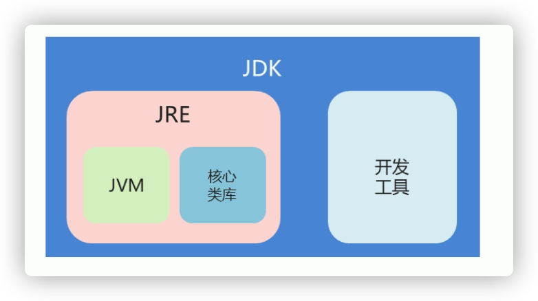

# java基础

## 一、java概述

### 1、java语言跨平台原理

jvm（java虚拟机）

### 2、JRE和JDK

1. JRE（Java Runtime Environment）java运行时环境

   包含jvm和运行时所需要的核心类库

2. JDK（Java DEvelopment Kit）java开发工具包

   编译工具（javac.exe）和运行工具（java.exe）


### 3、JDK下载和安装

​	JDK的安装目录

| 目录名称                           | 说明                                             |
| ---------------------------------- | ------------------------------------------------ |
| <span style='color:red'>bin</span> | 改路径下存放了JDK的各种工具命令。（javac和java） |
| conf                               | 该路径下存放了JDK的相关配置文件。                |
| include                            | 该路径下存放了一些平台特定的头文件。             |
| jmods                              | 改路径下存放了JDK各模块。                        |
| legal                              | 该路径下存放了JDK各模块的授权文档。              |
| lib                                | 该路径下存放了JDK工具的一些补充JAR包。           |


## 二、第一个java程序

### 1、常用的DOS命令

| 操作       | 说明                 |
| ---------- | -------------------- |
| 盘符名称： | 盘符切换。           |
| dir        | 查看当前路径下的内容 |
| cd 目录    | 进入单级目录         |
| cd ..      | 回退到上一级目录     |
| cd \       | 回退到盘符根目录     |
| cls        | 清屏                 |
| exit       | 退出命令提示窗口     |

### 2、path环境变量配置

%JAVA_HOME%\bin

### 3、HelloWorld案例

编写程序 、编译程序（javac java文件名称.java）、运行程序(java 类名)

## 三、基础语法

### 1、注释

- 单行 //
- 多行 /* */
- 文档  /** */

### 2、关键字

特点：字母全部小写

### 3、常量

### 4、数据类型

| 数据类型 | 关键字       | 内存占用 | 取值范围                                                     |
| -------- | ------------ | -------- | ------------------------------------------------------------ |
| 整数     | byte         | 1        | -128 ~ 127                                                   |
|          | short        | 2        | -32768 ~ 32767                                               |
|          | int（默认）  | 4        | -2的31次方到2的31次方-1                                      |
|          | long         | 8        | -2的63次方到2的63次方-1                                      |
| 浮点数   | float        | 4        | 负数：-3.402823E+38到-1.401298E-45<br />正数：1.49000000E-324到3.402823E+38 |
|          | double(默认) | 8        | 负数：-1.797693E+308到-4.9000000E-324<br />正数：4.9000000E-324到1.797693E+308 |
| 字符     | char         | 2        | 0 ~ 65535                                                    |
| 布尔     | boolean      | 1        | true、false                                                  |

E+38表示乘以10的38次方。

### 5、变量

数据类型 变量名 = 变量值；

int a = 10;

### 6、标识符

​	1、规则

- 由数字、字符、下划线和美元符组成

- 不能以数字开头

- 不能是关键字

- 区分大小写

  2、约定

  小驼峰命名法：方法、变量

  大驼峰命名法：类

  

### 7、类型转换

1. 自动类型转换

   

2. 强制类型转换

目标数据类型 变量名 = （目标数据类型）值或变量

## 四、运算符

### 1、算术运算符

+、—、*、/、%

### 2、赋值运算符

=、+=、-=

### 3、自增自减运算符

++、--

### 4、关系运算符

==、!=、>、>=、<、<=

### 5、逻辑运算符

&、|、^、！ 

短路：&&、||

### 6、三元运算符

关系表达式？表达式1：表达式2；


## 五、数据输入

Scanner类

```java
//1、导包
import java.util.Scanner
//2、创建对象
Scanner sc = new Scanner(System.in);
//3、接收数据
int x = sc.nextInt();
```


## 六、分支语句

### 流程控制

- 顺序结构
- 分支结构（if、switch）
- 循环结构（for、while、do…while）

 

## 七、IDEA工具

### 1、内容辅助键

- 快速生成main（）方法：psvm回车
- 快速生成输出语句：sout回车
- Ctrl +Alt+space：内容提示、代码补全

### 2、快捷键

- 注释

  Ctrl + /:单行

  Ctrl + Shift + /:多行

- 格式化

  Ctrl + Alt +L：格式化


## 八、数组

### 1、数组定义

数据类型[ ] 变量名

数据类型 变量名[ ]

### 2、数组初始化

- 动态初始化

  数据类型[ ] 变量名 = new 数据类型[数组长度]

- 静态初始化

  指定每个元素的值，由系统决定长度

  数据类型[ ] 变量名 = new 数据类型{数据1，数据2，···}

  数据类型[ ] 变量名 = {数据1，数据2，···}


### 3、内存分配

- 栈内存

  局部变量，使用完成立即消失

- 堆内存

  存储new出来的内容，初始化时设置默认值，使用完毕会在垃圾回收器空闲时被回收

### 4、数组常见操作

1. 遍历
2. 获取最值

## 九、方法

### 1、方法定义

```java
	public static 返回值类型 方法名(参数···){
  	//方法体
    return 数据;
	}
```

### 2、形参和实参

形参的值不影响实参的值

### 3、方法重载

同一个类中多个方法之间的关系

1. 多个方法在同一个类中
2. 多个方法具有相同的方法名
3. 多个方法的参数不相同，类型不同或数量不同
4. 与返回值无关

## 十、面向对象基础

### 1、类和对象

- 类是对象的数据模型
- 类是具有相同属性和行为的一组对象的集合

### 2、类的定义

​	类是java程序的基本组成单位

​	类的组成：属性（成员变量）和行为（成员方法）

### 3、成员变量和局部变量

​	成员变量：类中方法外

​						堆内存

​						随对象存在和消失

​						有默认初始化值

​	局部变量：方法内或方法声明上

​						栈内存

​						随方法调用存在和消失

​						无默认初始化值，必须先定义，赋值才能使用

### 4、封装

1. private关键字

   一个权限修饰符

   可以修饰成员（变量、方法）

   作用是保护成员不被别的类使用，只能在本类中才能访问

   提供get()、set()方法供外界使用

2. this关键字

   this修饰的变量用于指代成员变量

   解决局部变量隐藏成员变量

   this代表调用的对象

3. 封装

   将类的某些现象隐藏在类的内部，不允许外部程序访问，而是通过该类提供的方法来实现隐藏信息的操作和访问

### 5、构造方法

​		作用：创建对象并完成对象初始化

​		如果没有定义构造方法，系统提供默认无参构造方法

​		如果定义了带参构造方法，还要使用无参构造方法，就必须再写一个无参数构造方法

## 十一、字符串

### 1、API

​	Application Programming Interface：应用程序编程接口

​	java.long下的不需要导包

### 2、String

1. 特点

   - 字符串不可变，它们的值在创建后不能被更改
   - String值不可变，但是可以被共享
   - 字符串效果上相当于字符数组（char[ ]），但是底层原理是字节数组（byte[ ]）

2. String构造方法

   | 方法名                    | 说明                                      |
   | ------------------------- | ----------------------------------------- |
   | public String()           | 创建一个空白字符串对象，不含任何内容      |
   | public String(char[] chs) | 根据字符数组的内容，来创建字符串对象      |
   | public String(byte[] chs) | 根据字节数组的内容，来创建字符串对象      |
   | String s = "abc"          | 直接赋值的方式创建字符串对象，内容就是abc |

   

3. String对象的特点

   - 通过new创建的字符串对象，每次都会申请一个内存空间，虽然内容相同，但是地址值不同
   - 以""方式创建的字符串对象，只要字符序列相同（顺序和大小写），不管出现多少次，JVM都只会建立一个String对象，并在字符串池中维护

4. 字符串的比较

   - 使用 == 比较

     基本类型：比较数据值是否相同

     引用类型：比较地址值是否相同

   - equals（）

     比较内容是否相同

### 3、StringBuilder

1. 概述

   - 可变的字符串类，可以看成一个容器
   - 可变是指StringBuilder对象中的内容可变

2. String和StringBuilder的区别

   - String：内容不可变
   - StringBuilder：内容可变

3. 构造方法

   - public StringBuilder()
   - public StringBuilder(String str)

4. 添加和反转方法

   - public StringBuilder append（任意类型）：添加数据并返回对象本身
   - public StringBuilder reverse（）返回相反的字符串序列

5. StringBuilder和String相互转换

   - StringBuilder转换为String

     public String toString（）

   - String转换为StringBuilder

     public StringBuilder（String str）

## 十二、集合

### 1、ArrayList<E>

1. 概述

   可调整大小的数组实现

   <E>是一种特殊的数据类型，泛型

2. 构造方法和添加方法

   | 方法名                                | 说明                               |
   | ------------------------------------- | ---------------------------------- |
   | public ArrayList()                    | 创建一个空的集合对象               |
   | public boolean add(E e)               | 将指定元素追加到此集合的末尾       |
   | public void add(int index, E element) | 在此集合中指定的位置插入指定的元素 |

3. 常用方法

   | 方法名                             | 说明                                   |
   | ---------------------------------- | -------------------------------------- |
   | public boolean remove(Object o)    | 删除指定元素，返回是否成功             |
   | public E remove(int index)         | 删除指定索引处的元素，返回被删除的元素 |
   | public E set(int index, E element) | 修改指定索引处的元素，返回修改的元素   |
   | public E get(int index)            | 返回指定索引处的元素                   |
   | public int size()                  | 返回集合中元素的个数                   |

### 2、

## 十三、继承

### 1、概述

1. ​	继承是面向对象的三大特征之一。可以使得子类具有父类的属性和方法，还可以在子类中重新定义，追加属性和方法。

2. 格式

   public class 子类名 extends 父类名{}

3. 利弊

   提高代码的复用性，提高代码的维护性

   类的耦合性增强了

4. 什么时候使用继承

   is a

### 2、super关键字

### 3、构造方法访问

​	子类中所有的构造方法默认都会访问父类中无参的构造方法。

原因：

- 因为子类会继承父类中的数据，可能还会使用父类的数据。所以子类初始化之前，一定要先完成父类数据的初始化
- 每一个子类构造方法的第一条语句默认都是：super()

### 4、重写

1. 概述

   子类中出现了和父类中一模一样的方法声明

2. 应用

   当子类需要父类的功能，而功能主体子类有自己特有内容时，可以重写父类中的方法

3. 注解

   @Override：检查重写方法的方法声明的正确性

4. 注意事项

   - 私有方法不能被重写（父类私有成员子类不能继承）
   - 子类方法访问权限不能更低（public > 默认> private）

### 5、继承注意事项

1. java中类只支持单继承，不支持多继承
2. java中类支持多层继承

## 十四、修饰符

	### 1、包

​	其实就是文件夹，作用对类进行分类管理

### 2、导包

​	关键字：import

### 3、修饰符

1. 权限修饰符

   | 修饰符    | 同一个类中 | 同一个包中子类无关类 | 不同包子类 | 不同包无关类 |
   | --------- | ---------- | -------------------- | ---------- | ------------ |
   | private   | Y          |                      |            |              |
   | 缺省      | Y          | Y                    |            |              |
   | protected | Y          | Y                    | Y          |              |
   | public    | Y          | Y                    | Y          | Y            |

   

2. 状态修饰符

   - final关键字

     修饰方法：表明是最终方法，不能被重写

     修饰变量：表明是常量，不能再次被赋值

     修饰类：表明是最终类，不能被继承

     修饰局部变量：

     ​	基本类型：数据值不能发生改变

     ​	引用类型：地址值不能发生改变，但是地址里面的内容可以改变

   - static关键字

     1. 可以修饰成员方法、成员变量
     2. 特点：

     ​	被类的所有对象共享（判断是否使用static的条件）

     ​	可以通过类名调用，也可以通过对象调用

     3. 访问特点

        非静态成员方法：

        ​	能访问静态的成员变量

        ​	能访问非静态的成员变量

        ​	能访问静态的成员方法

        ​	能访问非静态的成员方法

        静态的成员方法

        ​	能访问静态的成员变量

        ​	能访问静态的成员方法

     **静态成员方法只能访问静态成员**

## 十五、多态

### 1、概述

同一个对象，在不同时刻表现出来的不同形态

多态形式：具体类多态、抽象类多态、接口多态

### 2、前提

- 有继承/实现关系
- 有方法重写
- 有父类/接口引用指向子/实现类对象

### 3、成员访问特点

- 成员变量：编译看左边，执行看左边

- 成员方法：编译看左边，执行看右边

  原因：成员方法有重写，而成员变量没有

### 4、利弊

- 提高程序的扩展性

  定义方法的时候，使用父类型作为参数，将来在使用的时候，使用具体的子类型参与操作

- 不能使用子类的特有功能

### 4、多态中的转型

- 向上转型

  从子到父：父类引用指向子类对象

- 向下转型

  从父到子：父类引用转为子类对象

## 十六、抽象类

### 1、概述

​	一个没有方法体的方法应该定义为抽象方法，而类中如果有抽象方法，该类必须定义为抽象类

### 2、特点

- 必须使用关键字：abstract修饰

- 抽象类中不一定有抽象方法，但是有抽象方法的类一定是抽象类

- 抽象类不能实例化

  ​	抽象类多态：通过子类对象实例化

- 抽象类的子类

  ​	要么重写抽象类中的所有抽象方法

  ​	要么是抽象类

### 3、成员特点

- 成员变量

  ​	可以使变量，也可以是常量

- 构造方法

  ​	有构造方法，但是不能实例，用于子类访问父类数据的初始化

- 成员方法

  ​	可以有抽象方法：限定子类必须完成某些动作

  ​	也可以有非抽象方法：提高代码复用性

### 十七、接口

### 1、概述

​	接口是一种公共的规范标准，只要符合规范标准，大家可以通用，java中的接口更多体现在对行为的抽象

### 2、特点

- 接口用关键字interface修饰

- 类实现接口用implements表示

- 接口不能实例化

  ​	接口多态：通过实现类对象实例化

- 接口的实现类

  ​	要么重写接口中的所有抽象方法

  ​	要么是抽象类

### 3、成员特点

- 成员变量

  只能是常量：默认修饰符：public static final构造方法

- 构造方法

  ​	接口没有构造方法，因为接口主要是对行为进行抽象，没有具体存在

  ​	一个类如果没有父类，默认继承自Object类

- 成员方法

  ​	只能是抽象方法：默认修饰符：public abstract

  新特性：

### 4、类和接口的关系

- 类和类的关系：继承关系

  ​	只能单继承，但是可以多层继承

- 类和接口的关系：实现关系

  ​	可以单实现，也可以多实现，还可以在继承一个类的同时实现多个接口

- 接口和接口的关系：继承关系

  ​	可以单继承，也可以多继承

### 5、抽象类和接口的区别

- 成员区别

  ​	抽象类：变量，常量；有构造方法；有抽象方法，也有非抽象方法

  ​	接口：常量；抽象方法

- 关系区别

  ​	见4

- 设计理念的区别

  ​	抽象类：对类抽象，包括属性、行为

  ​	接口：对行为抽象，主要是行为

## 十八、 形参和返回值

	### 1、类名作为形参和返回值

​	对象

### 2、抽象类名作为形参和返回值

​	抽象类的子类对象

### 3、接口名作为形参和返回值

​	接口的实现类对象

## 十九、内部类

### 1、概述

在一个类中定义一个类

格式：

```java
	public class 类名{
    	修饰符 class 类名{
      }
  }
```

### 2、内部类访问特点

- 内部类可以直接访问外部类的成员，包括私有
- 外部类要访问内部类的成员，必须创建对象

### 3、成员内部类

- 格式：外部类名.内部类名 对象名 = 外部类对象.内部类对象

### 4、局部内部类

### 5、匿名内部类

- 前提：存在一个类（具体类/抽象类）或者接口
- 格式：

```java
	new 类名或者接口名(){
    重写方法;
  };
```

- 本质：是一个继承了该类或者实现了该接口的子类匿名对象

## 二十、常用API


​		

​		


